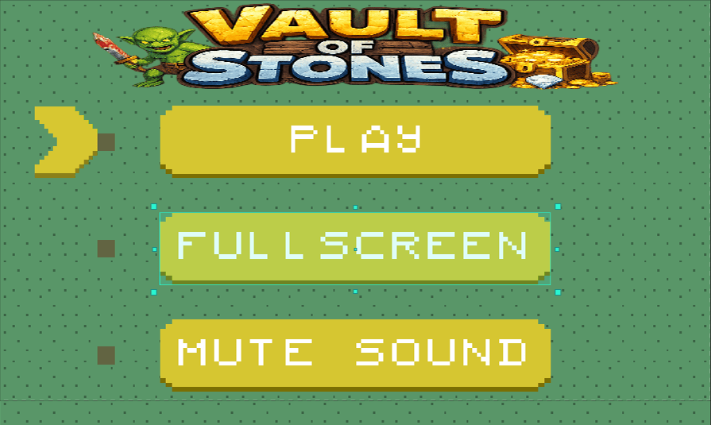
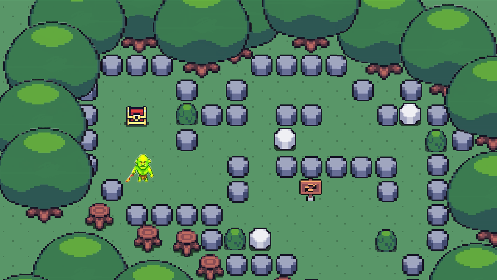
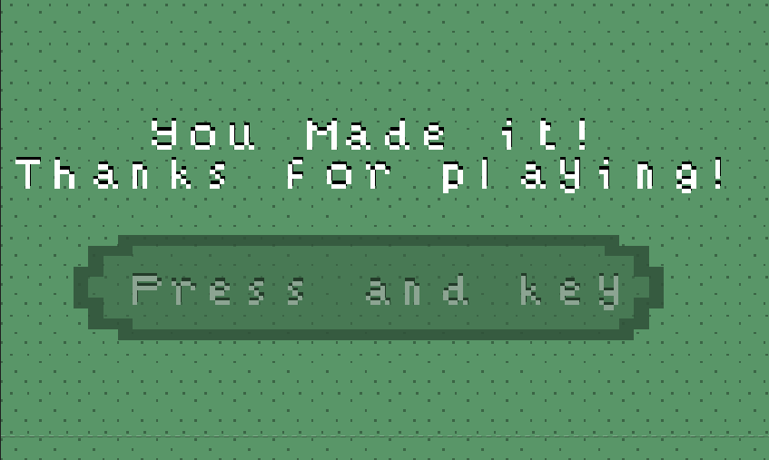

# 🏛️ VAULT OF STONES

<p align="center">
  
</p>

<p align="center">
  <b>Game Puzzle Adventure 2D berbasis Construct 3</b>
</p>

<p align="center">
  <i>Jelajahi area misterius, hadapi rintangan batu, dan selesaikan puzzle untuk mencapai tujuan.</i>
</p>

---

## 📖 Deskripsi Game

**VAULT OF STONES** adalah game puzzle adventure 2D yang dikembangkan menggunakan **Construct 3**. Game ini membawa pemain ke dalam sebuah area hutan misterius yang dipenuhi batu, pepohonan, peti, papan petunjuk, dan berbagai rintangan yang harus dilewati.

Dalam permainan ini, pemain mengendalikan karakter untuk menjelajahi area level serta menyelesaikan tantangan yang tersedia. Susunan batu dan objek pada area permainan dirancang sebagai bagian dari puzzle, sehingga pemain perlu memperhatikan jalur, posisi objek, dan langkah yang tepat agar dapat menyelesaikan permainan.

Game ini menggunakan tampilan visual bergaya **pixel art** dengan tema petualangan dan eksplorasi ruang misterius.

---

## 🎯 Tujuan Permainan

Tujuan utama dalam game **VAULT OF STONES** adalah menyelesaikan puzzle pada area permainan dan mencapai akhir level.

Pemain diharapkan dapat:

- Menjelajahi area permainan.
- Mengamati susunan batu dan rintangan.
- Menentukan jalur yang tepat.
- Menyelesaikan tantangan pada level.
- Mencapai tampilan akhir permainan.

---

## 🎮 Tampilan Game

### 1. Menu Utama

Pada menu utama, pemain dapat melihat judul game **VAULT OF STONES** dengan tampilan bertema petualangan. Menu ini menyediakan beberapa tombol utama untuk mengatur permainan sebelum dimulai.

Fitur yang tersedia pada menu utama:

- **Play** untuk memulai permainan.
- **Fullscreen** untuk memainkan game dalam tampilan layar penuh.
- **Mute Sound** untuk mematikan suara permainan.

<p align="center">
  
</p>

<p align="center">
  <i>Gambar 1. Tampilan menu utama game VAULT OF STONES.</i>
</p>

---

### 2. Tampilan Gameplay

Pada bagian gameplay, pemain berada di area hutan yang berisi berbagai objek seperti batu, pepohonan, semak, papan petunjuk, peti, dan karakter utama.

Susunan batu pada level menjadi bagian penting dalam tantangan permainan. Pemain perlu mengamati area dan menentukan arah gerakan yang sesuai untuk menyelesaikan puzzle.

<p align="center">
  
</p>

<p align="center">
  <i>Gambar 2. Tampilan gameplay pada area puzzle game VAULT OF STONES.</i>
</p>

---

### 3. Tampilan Akhir Permainan

Setelah pemain berhasil menyelesaikan tantangan, game menampilkan halaman akhir dengan pesan ucapan terima kasih. Tampilan ini menandakan bahwa pemain telah menyelesaikan permainan.

<p align="center">
  
</p>

<p align="center">
  <i>Gambar 3. Tampilan akhir setelah pemain menyelesaikan permainan.</i>
</p>

---

## ✨ Fitur Utama

Game **VAULT OF STONES** memiliki beberapa fitur utama, yaitu:

- Menu utama dengan identitas visual game.
- Tombol **Play** untuk memulai permainan.
- Tombol **Fullscreen** untuk tampilan layar penuh.
- Tombol **Mute Sound** untuk mengatur suara permainan.
- Area gameplay bertema hutan misterius.
- Puzzle berbasis susunan batu dan jalur permainan.
- Karakter utama yang dapat dikendalikan pemain.
- Tampilan akhir setelah permainan berhasil diselesaikan.
- Desain visual bergaya pixel art.

---

## 🕹️ Cara Bermain

1. Buka dan jalankan game melalui **Construct 3**.
2. Pada halaman menu utama, tekan tombol **Play**.
3. Pemain akan masuk ke area level permainan.
4. Gerakkan karakter untuk menjelajahi area hutan.
5. Amati susunan batu, jalur, dan objek yang tersedia.
6. Selesaikan tantangan untuk mencapai akhir permainan.
7. Setelah berhasil, pemain akan melihat tampilan **Thanks For Playing**.

---

## 🧩 Konsep Gameplay

Konsep utama game ini adalah permainan puzzle berbasis eksplorasi. Pemain harus bergerak di dalam area level yang telah dirancang dengan susunan objek tertentu.

| Elemen Game | Fungsi |
|---|---|
| Karakter Utama | Dikendalikan pemain untuk menjelajahi area |
| Batu | Menjadi rintangan dan bagian dari puzzle |
| Pepohonan | Menjadi batas area permainan |
| Semak | Menambah detail lingkungan permainan |
| Peti | Menjadi elemen visual bertema petualangan |
| Papan Petunjuk | Menjadi objek pendukung pada area level |
| Tampilan Akhir | Menandakan permainan telah selesai |

---

## 🎨 Desain Visual

Desain game **VAULT OF STONES** menggunakan gaya visual **pixel art** dengan tema hutan dan petualangan.

Beberapa unsur visual yang digunakan antara lain:

- Warna hijau sebagai latar utama area hutan.
- Pepohonan besar sebagai pembatas level.
- Batu-batu sebagai elemen utama puzzle.
- Karakter bertema petualangan.
- Logo game dengan unsur batu, peti harta, dan karakter fantasi.

Desain ini dipilih agar game memiliki tampilan sederhana, menarik, dan sesuai dengan konsep permainan puzzle adventure.

---

## 🛠️ Teknologi yang Digunakan

| Teknologi | Keterangan |
|---|---|
| Construct 3 | Software utama untuk mengembangkan game |
| GitHub | Repository untuk menyimpan dan mendokumentasikan proyek |
| Pixel Art Assets | Elemen visual karakter, lingkungan, tombol, dan objek permainan |

---

## 📁 Struktur Repository

Struktur file pada repository ini adalah sebagai berikut:

```text
game-contruck3-VAULT-OF-STONES/
├── images/
│   ├── gameplay-level.png
│   ├── menu-utama.png
│   └── proses-pembuatan.png
├── fileprojekgame.c3p
├── README.md
```

Keterangan file:

| File / Folder | Keterangan |
|---|---|
| `images/` | Berisi screenshot dokumentasi game |
| `images/menu-utama.png` | Screenshot menu utama permainan |
| `images/gameplay-level.png` | Screenshot area gameplay dan puzzle |
| `images/proses-pembuatan.png` | Screenshot tampilan akhir permainan |
| `fileprojekgame.c3p` | File utama proyek Construct 3 |
| `README.md` | Dokumentasi proyek |

---

## 📥 Cara Membuka Proyek

Untuk membuka proyek ini, ikuti langkah berikut:

1. Unduh file `fileprojekgame.c3p` dari repository.
2. Buka **Construct 3** melalui aplikasi atau browser.
3. Pilih menu untuk membuka project.
4. Masukkan file `fileprojekgame.c3p`.
5. Jalankan preview untuk memainkan game.

---

## 🚧 Status Pengembangan

Game **VAULT OF STONES** saat ini merupakan proyek game puzzle yang telah memiliki:

- Menu utama.
- Area gameplay.
- Karakter pemain.
- Susunan puzzle batu.
- Tampilan akhir permainan.

Pengembangan berikutnya dapat dilakukan dengan menambahkan:

- Level baru dengan tantangan berbeda.
- Variasi puzzle yang lebih banyak.
- Sistem perpindahan antarlevel.
- Animasi dan efek suara tambahan.
- Perbaikan tampilan menu.
- Pengujian bug permainan.
- Versi web yang dapat dimainkan langsung melalui browser.

---

## 🌐 Demo Game

Versi demo berbasis browser akan ditambahkan setelah game selesai diekspor dan dipublikasikan.

```text
Demo Game: Belum tersedia
```

---

## 👤 Pengembang
 
Pengembang game **VAULT OF STONES** menggunakan Construct 3.

---

## 📄 Catatan Asset 

Proyek ini dikembangkan sebagai proyek pembelajaran dan portofolio pengembangan game.

Screenshot yang ditampilkan dalam repository merupakan dokumentasi tampilan game. Untuk asset seperti karakter, tombol, logo, audio, atau elemen visual lainnya yang berasal dari pihak ketiga, penggunaannya tetap mengikuti lisensi dan ketentuan dari pemilik asset masing-masing.

Repository dapat diberikan open-source apabila seluruh file dan asset yang dibagikan telah dipastikan memiliki izin untuk dipublikasikan.
